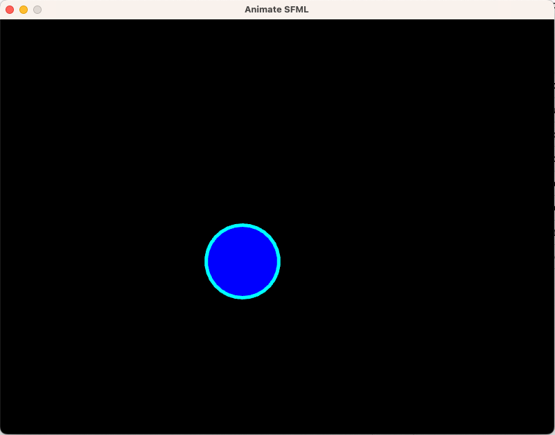

# Animate SFML

The purpose of this C++ application is to create a simple animation using the [SFML](https://www.sfml-dev.org/index.php) library.

## Key Controls

| Key      | Action                    |
|----------|---------------------------|
| `Space`  | Pause/Resume ball inertia |
| `Up`     | Move ball upwards         |
| `Down`   | Move ball downwards       |
| `Left`   | Move ball to the left     |
| `Right`  | Move ball to the right    |
| `Escape` | Exit application          |
| `N`      | Reset ball position       |

